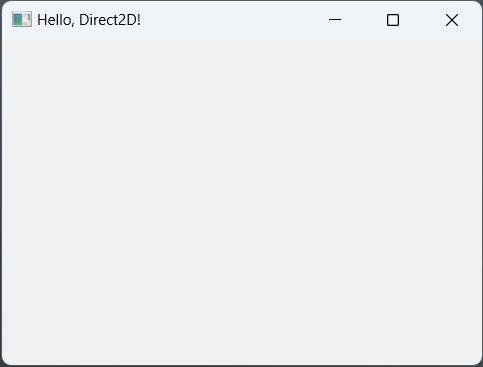

# Hello, Direct2D

We are going to develop a simple static view for our first Direct2D application. This application is similar to the [Quick Start](https://learn.microsoft.com/en-us/windows/win32/direct2d/getting-started-with-direct2d) application in the Microsoft Windows Getting Started with Direct2D tutorial.

## The Project

Lets start by creating new Rust project:

```cargo new hello_d2d```

The windows-rs crate makes extensive use of features. You should check out the [Cargo Book](https://doc.rust-lang.org/cargo/) section on [features](https://doc.rust-lang.org/cargo/reference/features.html) if you are unfamiliar with how features are used in Rust. 

We need to start by adding the minimum set of window crate features to our ```Cargo.toml``` file that we need for our simple *Hello, World* application. We use version 0.42 of the windows crate so lets start there: 

``` toml
#[dependencies.windows]
version = "0.42"
```

We will use some basic foundational windows crate features for every Win32 application in this book so we will need to add those to the cargo file. Under the ```version = 0.42"``` that you just added, add the following features:

``` toml
features = [
    "Win32_Foundation",
    "Win32_Graphics_Direct2D",
    "Win32_Graphics_Gdi",
    "Win32_UI_WindowsAndMessaging",
    "Win32_System_LibraryLoader"
]

```

## MainWindow

Under the ```src``` path open the ```main.rs``` file. We are going to start with a minimal Win32 application and explain the basics before we add the Direct2D rendering.

We need to create a struct that will represent our window

``` rust
pub struct MainWindow {
        handle: HWND,
}
```
We are only going to store the HWND for now so this is the only field in the structure. It will be a private field since no functions outside the ```MainWindow``` implementation will need to access it.

* NOTE: [HWND](https://learn.microsoft.com/en-us/windows/win32/winmsg/about-windows#window-handle) is a unique identifier of a window instance in Win32.

The implementation of the ```MainWindow``` will create and display a simple [OVERLAPPED](https://learn.microsoft.com/en-us/windows/win32/winmsg/window-styles) window. We need to create a ```new``` method and a windows procedure (wnd_proc) for a minimal Win32 Application.

* NOTE: We have to use some ```unsafe``` code with the windows crate and we will keep the unsafe scopes to a minimum. ```unsafe``` can be a deep topic in Rust and for the purposes of this book we will use unsafe code from the windows crate but we will not be using any unsafe Rust features outside of that context.

We will need a couple of constants to register our new window class so lets go ahead and create those just after the using statements:

``` rust
const WINDOW_CLASSNAME: &HSTRING = w!("bytetrail.rustd2d.hello");
const WINDOW_TITLE: &HSTRING = w!("Hello, Direct2D!");
```

These constants are defined as references to ```HSTRING```s. The ```w!``` macro is used to convert a ```'static &str``` to a ```&HSTRING```. We use HSTRING constants here because they will be needed when we register our windows class and give it a title.

We define a static instance of a  [```Once```](https://doc.rust-lang.org/std/sync/struct.Once.html) synchronization primitive at the top of the file, typically just before or after your consts. This will be used when we register the window class below :

``` rust 
static REGISTER_WINDOW_CLASS: Once = Once::new();
```

## MainWindow Implementation
The following sections describe the methods and associated functions we need to define in the ```MainWindow``` implementation to get a basic Win32 application window before we move on to the Direct2D methods.

``` rust
impl MainWindow {
 ...
}
```

Each of the following methods or associated functions is defined in the ```MainWindow``` implementation.

### Registering and Creating

Lets start with the new method for our MainWindow. The signature of the new method may look a little strange if you have not used [```Box```](https://doc.rust-lang.org/std/boxed/struct.Box.html) before. We are using a ```Box```ed return type because we will need a heap allocated instance of the ```MainWindow``` later. 

The first thing we need do is get an instance handle that we will use when we create the window with the ```CreateWindowExW``` Win32 function:

``` rust
    pub fn new() -> Result<Box<Self>> {
        let instance = unsafe { GetModuleHandleW(None)? };
```

Next we register the windows class. This is done with a [```Once```](https://doc.rust-lang.org/std/sync/struct.Once.html) synchronization primative so that the windows class is registered only one time in the application no matter how many times new is called. Within the closure of ```call_once``` we define a windows class and register it

```rust 
...
        // synchronization for a one time initialization of FFI call
        REGISTER_WINDOW_CLASS.call_once(|| {
            // use defaults for all other fields
            let class = WNDCLASSW {
                lpfnWndProc: Some(Self::wnd_proc),
                hbrBackground: HBRUSH(COLOR_WINDOW.0 as isize),
                hInstance: instance,
                style: CS_HREDRAW | CS_VREDRAW,
                hCursor: unsafe { LoadCursorW(HINSTANCE(0), IDC_ARROW).ok().unwrap() },
                lpszClassName: WINDOW_CLASSNAME.into(),
                ..Default::default()
            };
            assert_ne!(unsafe { RegisterClassW(&class) }, 0);
        });
```

If you are completely new to Win32 development there is a lot to unpack there. Inside the ```call_once()``` closure we are creating a [```WNDCLASSW```](https://microsoft.github.io/windows-docs-rs/doc/windows/Win32/UI/WindowsAndMessaging/struct.WNDCLASSW.html) with the required parameters. The ```lpfnWndProc``` field points to a method in our ```MainWindow``` class that we have not written yet. 

Next we set the background brush. The Win32 API defines a number of standard colors that are available through the windows crate although we have to do some casting to get them to the type we want. 

We set the ```hInstance``` to the instance we got earlier and the ```style```, and ```hcursor``` are typical for a top level window.

The ```lpszClassName``` uses the ```HSTRING``` constant we defined at the top of the file to uniquely identify this windows class.

The next line :
``` rust 
    ..Default::default()
```

sets the remainder of the fields to default values for the ```WNDCLASSW``` struct. The [```std::default::Default```](https://dev-doc.rust-lang.org/beta/std/default/trait.Default.html) trait documentation describes this usage. 

The next line registers the windows class using the [```RegisterClassW```](https://microsoft.github.io/windows-docs-rs/doc/windows/Win32/UI/WindowsAndMessaging/fn.RegisterClassW.html) function with the ```WNDCLASSW``` struct instance and asserts that the registration was successful by comparing the return to 0.

You can learn more about defining and registering windows classes with the [Microsoft API documentation](https://learn.microsoft.com/en-us/windows/win32/api/winuser/nf-winuser-registerclassw)

Now that our windows class is registered, we create an instance of the ```MainWindow``` struct. For now the ```HWND``` is set to ```HWND(0)``` since we do not yet have a window handle.

``` rust
        let mut main_window = Box::new(MainWindow {
            handle: HWND(0),
        });
```

Creating a window is a single call to [```CreateWindowExW```](https://microsoft.github.io/windows-docs-rs/doc/windows/Win32/UI/WindowsAndMessaging/fn.CreateWindowExW.html). This is wrapped in an ```unsafe``` block as much of the windows crate API. We use a default style, the class name we previously declared and our title from the ```HSTRING``` constant.

We us the ```WS_VISIBLE``` and ```WS_OVERLAPPED``` styles for a typical resizable top-level window with a title bar and minimize, maximize and close buttons. The next set of parameters are the location and size. ```CS_USEDEFAULT``` instructs the API to use default settings here for location and we set the size to a width of 400 and a height of 300. You can change these to other values if you would like or use ```CW_USEDEFAULT``` for width and height.

The next 2 parameters are the parent window handle and menu handle. We set these both to ```(0)``` since this is a top-level window without a parent and we do not have a menu. The ```HINSTANCE``` is next followed by a parameter that needs a bit of explanation:

``` rust
   ...
        let window = unsafe {
            CreateWindowExW(
                WINDOW_EX_STYLE::default(),
                WINDOW_CLASSNAME,
                WINDOW_TITLE,
                WS_VISIBLE | WS_OVERLAPPEDWINDOW,
                CW_USEDEFAULT,
                CW_USEDEFAULT,
                400,
                300,
                HWND(0),
                HMENU(0),
                instance,
                Some(main_window.as_mut() as *mut _ as _),
            )
        };
        unsafe { ShowWindow(window, SW_SHOW) };
        Ok(main_window)
    }
```

The last parameter is an ```LPVOID``` in the Windows SDK which is defined as ```Option<*const c_void>``` in the windows crate. Since ```Box``` is used to allocate data on the heap in Rust it is possible to cast it to the appropriate type. We use type inference to perform the cast from a reference to the boxed type. A similar type cast could be done with :
```rust 
Box::into_raw(main_window) as _
```
This would; however, take ownership of the ```main_window``` and it would not be available to return from the new method after the ```ShowWindow``` function.

We want to pass the Box as an ```LPVOID``` so that it is available in the ```wnd_proc``` later when we receive the ```WM_CREATE``` message. This is a pointer to the instance of ```MainWindow``` that allows us to refence ```self``` for all subsequent windows messages. The Microsoft documentation for [CreateWindowExW](https://learn.microsoft.com/en-us/windows/win32/api/winuser/nf-winuser-createwindowexw) explains that the lpParam paramter is passed to the window through the [CREATESTRUCT](https://learn.microsoft.com/en-us/windows/win32/api/winuser/ns-winuser-createstructa) and is available as the ```LPARAM``` in the ```WM_CREATE``` message.

That seems like a lot to create and show a window. You know that if you have done Win32 development in the past that it is all pretty much boilerplate and you will have very similar methods for all of your struct implementations for windows in Rust.

 Now that we have the new method out of the way we will move on to the ```wnd_proc``` method we referenced in the ```WNDCLASSW```struct.

 ### Message Handling

The windows procedure or ```wnd_proc``` is the main message loop for a window class. It is important to remember that there is one ```wnd_proc``` per windows class not per windows instance. You will see how we route messages to a specific instance of a window class below.

``` rust
   unsafe extern "system" fn wnd_proc(
        window: HWND, message: u32, wparam: WPARAM,lparam: LPARAM,
    ) -> LRESULT {
        ...
    }
```

```wnd_proc``` is an [associated function](https://doc.rust-lang.org/rust-by-example/fn/methods.html) declared with the ```unsafe``` and [```extern```](https://doc.rust-lang.org/std/keyword.extern.html) keywords. The string in quotes after the ```extern``` keyword indicates the ABI to use. In this case it is [```extern "system"```](https://doc.rust-lang.org/reference/items/external-blocks.html) so that the associated function is exported with the ```stdcall``` ABI rather than the C ABI. 

The associated function signature matches the required signature for a [WNDPROC](https://learn.microsoft.com/en-us/windows/win32/api/winuser/nc-winuser-wndproc) in Rust. The Microsoft documentation covers the parameters in detail if you are unfamiliar with the ```WNDPROC``` callback.

The implementation of our ```wnd_proc``` function has one primary responsibility; to extract the instance pointer to our instance of ```MainWindow``` as a mutable reference and dispatch messages to an instance specific method that takes ```&mut self```. We will add that implementation to ```wnd_proc```:

``` rust
        if message == WM_CREATE {
            let create_struct = lparam.0 as *const CREATESTRUCTA;
            let this = (*create_struct).lpCreateParams as *mut Self;
            (*this).handle = window;
            SetWindowLongPtrA(window, GWLP_USERDATA, this as _);
        } else {
            let this = GetWindowLongPtrA(window, GWLP_USERDATA) as *mut Self;

            if !this.is_null() {
                return (*this).message_handler(message, wparam, lparam);
            }
        }
        DefWindowProcW(window, message, wparam, lparam)

```

In the CreateWindowExW description, remember that we added a pointer to an instance of ```MainWindow``` in the ```CreateWindowExW``` function call? Here we need to extract that pointer and set it in the ```GWLP_USERDATA``` so that it is available on on all subsequent windows messages. This is what the ```if message == WM_CREATE``` block does when it calls ```SetWindowLongPtrA```. 

For more information please review the [windows crate](https://microsoft.github.io/windows-docs-rs/doc/windows/Win32/UI/WindowsAndMessaging/fn.SetWindowLongA.html) and [WIN32](https://learn.microsoft.com/en-us/windows/win32/api/winuser/nf-winuser-setwindowlongptra) documentation.

We use the corresponding ```GetWindowLongPtrA``` function to get the pointer to an instance of ```MainWindow``` on all other windows messages in the ```else``` block. We use the dereference operator to call the instance specific message handler method. Now we need to write our message handler.

``` rust
    fn message_handler(&mut self, message: u32, wparam: WPARAM, lparam: LPARAM) -> LRESULT {
        ...
    }
```

The message handler is a ```MainWindow``` method with a ```&mut self``` receiver. The WIN32 message ID, ```WPARAM```, and ```LPARAM``` are passed. ```WPARAM``` and ```LPARAM``` typically have message specific values and you will see how we leverage these in future chapters. For now though we are just going to handle the ```WM_DESTROY``` message so that we can close the application when the window is closed. Add the following implementation to ```message_handler```:

``` rust 
        match message {
            WM_DESTROY => {
                unsafe { PostQuitMessage(0) };
                LRESULT(0)            }
            _ => unsafe { DefWindowProcW(self.handle, message, wparam, lparam) },
        }
```
We are only handling the ```WM_DESTROY``` message here. For all others we are deferring to the ```DefWindowProcW``` handler. The [```WM_DESTROY```](https://learn.microsoft.com/en-us/windows/win32/winmsg/wm-destroy) message is typically sent to our window when the user clicks on the close window button or presses ALT-F4 when the window is in focus.

We call ```PostQuitMessage(0)``` in response to the ```WM_DESTROY``` message. This sends a ```WM_QUIT``` message to the application message queue. 

See the [windows-rs](https://microsoft.github.io/windows-docs-rs/doc/windows/Win32/UI/WindowsAndMessaging/fn.DefWindowProcW.html) and [WIN32](https://learn.microsoft.com/en-us/windows/win32/api/winuser/nf-winuser-defwindowprocw) documentation for more details on DefWindowProcW.

We have not written the application message handler so lets do that now.

### Application Loop

We need our main function to act as the windows application entry point and handle the application messages. We are going to change the function signature to return a [```windows::core::Result```](https://microsoft.github.io/windows-docs-rs/doc/windows/core/type.Result.html) and construct an instance of our ```MainWindow```:

``` rust
fn main() -> Result<()>{
    let _window = MainWindow::new()?;
    let mut message = MSG::default();
    unsafe {
        while GetMessageW(&mut message, HWND(0), 0, 0).into() {
            DispatchMessageW(&message);
        }
    }
    Ok(())
}
```

We are not really doing anything with the ```MainWindow``` ```window``` variable so we preface it with an ```_```. You cannot replace this with just an ```_``` variable due to how Rust handles these 2 cases. A variable preceded with an ```_``` like:
``` rust
    let _window = MainWindow::new()?;
```
results in a value being bound to the variable, which we need. An ```_``` variable will result in the returned value being discarded without being bound to a variable. If we had used this:
``` rust
    let _ = MainWindow::new()?;
```
instead of ```_window``` then the instance of ```MainWindow``` would not be availalbe for the remainder of the application.

Next in the code listing we create a ```MSG``` instance and start processing messages with ```GetMessageW``` and ```DispatchMessageW```. 

If everything went right and you have a project with all the code entered from the last few sections you should be able to run with
```
cargo run
```
from the project path and see the window:

